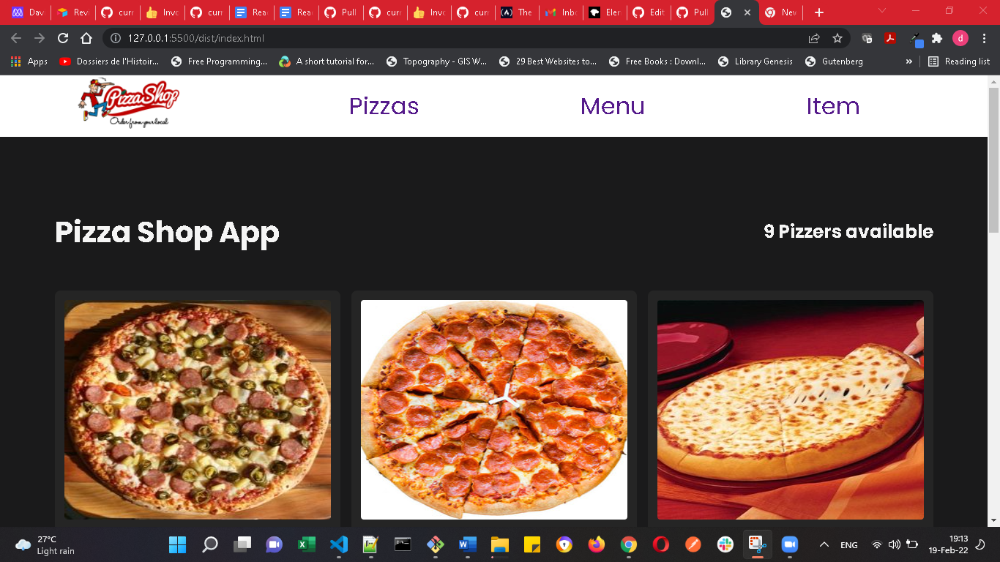

# The Pizza shop 

## Screenshot




## Project presentation
Please take a look at the video named Project.mp in this repository
## Description
The Pizza Shop website displays a Pizza. I allow users to likes their favorites pizza, make reservation and comment.

#``


## Getting started

To explore or play with this code you should :

- Download and install Git
- Clone the repository with: `https://github.com/denscholar/pizza-shop-microverse.git`
- Open the repository with: `cd pizza-shop-microverse` 
- Use your favorite Integrated Development Environment (e.g. for Visual Studio Code the command is `code .`)
- Install webpack with: `npm install --save-dev webpack webpack-cli`
- Type in `nmp run start` or run live server from the docs directory

### Open page in browser
```bash
$ open dist/index.html
```

## Technologies Used
* CSS
* HTML
* JAVASCRIPT
* Webpack
* GitHub

## Author

#### 👤 Author1
- GitHub: [@denscholar](https://github.com/denscholar)
- Twitter: [@denscholar](https://twitter.com/dennisakagha)
- LinkedIn: [LinkedIn](https://www.linkedin.com/in/dennisakagha/)

#### 👤 Author
- GitHub: [@david-lafontant](https://github.com/david-lafontant)
- Twitter: [@manikatex](https://twitter.com/manikatex)

## Contributing 
Contributions, issues, and feature requests are welcome!

## Show your support
Please give a ⭐️ if you like this project! 

## Acknowledgments
- Hat tip to anyone contributed one way or the other.
- Inspiration
- etc

## License
This project is [MIT](https://github.com/microverseinc/readme-template/blob/master/MIT.md) licensed.

